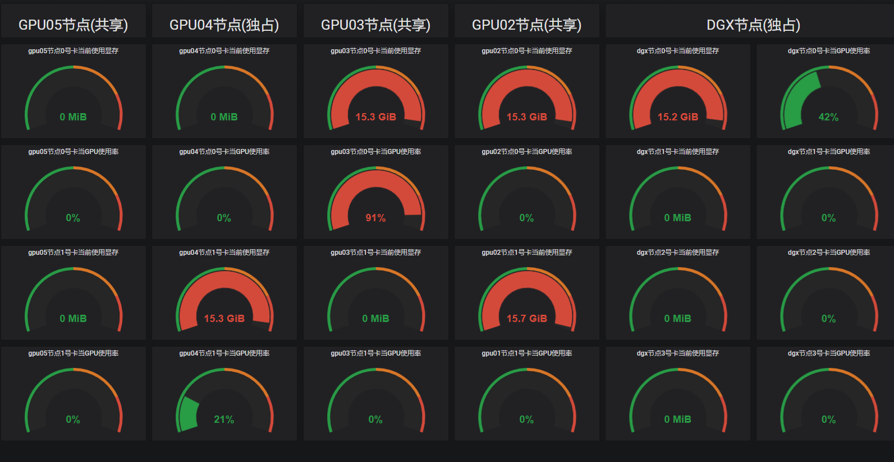

### monitor the gpu of k8s clkuster

This project could monitor the used of gpu in k8s cluster on node level and pod level;

1、prepare

* k8s cluster
* nvidia-docker2
* k8s-nvidia-plugin
* influxdb database

2、edit the file `gpu.py` and replace the` posturl` with your influxdb file.

3、build  your img

```shell
docker build -t YOURIMG:TAG .
```

4、use grafana to show the data:



 
